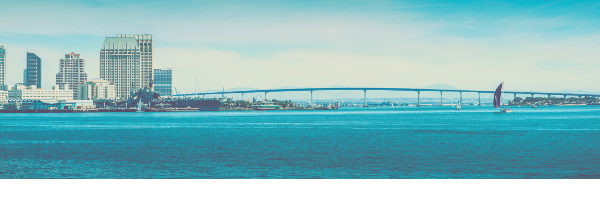

# willasur

 

### On GitHub I am:
- learning git and GitHub's features and functions
- creating repositories of projects
- checking for project updates and requirements

### ***I enjoy:***

- troubleshooting hardware and fixing network issues
- supporting administrators, engineers and clients
- working with peers to achieve a common goal

>*Outside of work I enjoy:*
- completing projects around the house
- exploring ecommerce and graphic design
- practicing scales and patterns on my guitar 

#### *Background*
- CompTIA
- Cisco
- Red Hat
- Linux Foundation
- Azure

### Contact

<https://linkedin.com/in/willasur/>

### Professional
**Cloud Operations**  
>Delivering core infrastructure and foundational technologies that power the cloud

